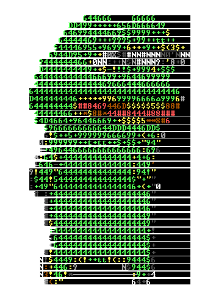

<h1 align="center">
     MercuryHgO
</h1>

<!--toc:start-->
- [About](#about)
    - [You can contact me with:](#you-can-contact-me-with)
    - [Find me on:](#find-me-on)
  - [Techology stack:](#techology-stack)
- [Projects](#projects)
- [Resources from:](#resources-from)
<!--toc:end-->
## About 
Hi! My name is Michael, im im fullstack web developer on JavaScript and Rust. 

I speak both 🇷🇺 Russian and 🇬🇧 English languages. 

#### You can contact me with:
- [Telegram](https://t.me/WinstonChurchella) 

#### Find me on:
- [HH ru](https://hh.ru/applicant/resumes/view?resume=7aedd18bff0caeb54d0039ed1f6b3537676c50)
- [Habr career](https://career.habr.com/bittermann1)
### Techology stack:

    
    
    
    
    

## Projects ##
- [Telegram bot](https://github.com/MercuryHgO/BOTiskaf)
- [Education Environment](https://github.com/MercuryHgO/EducationEnvironment) 
- [Comerse Project Server](https://github.com/MercuryHgO/comerse_project_server)
- ["Friendly" landing page](https://github.com/MercuryHgO/FriendlyLanding)

## Resources from:
[Techonlogy stack icons](https://devicon.dev/) 
